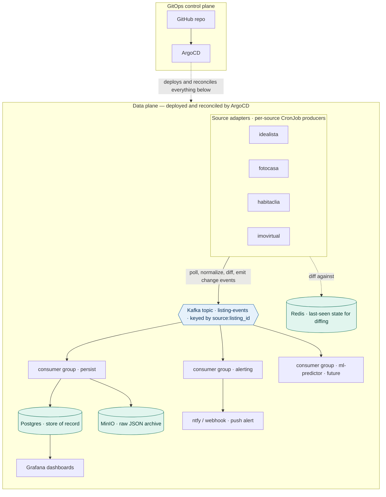

# Real Estate Data Platform — Design Doc

A GitOps-driven, event-streaming platform that ingests property listings from multiple
Spanish/Portuguese real-estate sources, detects changes, and fans them out to independent
consumers (persistence, alerting, and — later — ML price prediction).

This document is written to be handed to Claude Code as the source of truth for scaffolding.
It is opinionated on purpose. Where a decision is deferred, it says so explicitly.


---

## 1. Goals and non-goals

### Goals
- Ingest listings from **multiple sources** (Idealista first; Fotocasa, Habitaclia, Imovirtual later) behind a **pluggable source-adapter interface**, so adding a source is a small, contained change.
- Convert each polling source into a **stream of change events** (`listing.new`, `listing.price_changed`, `listing.removed`) rather than re-dumping snapshots.
- Fan those events out to **independent consumer groups** that each react in isolation.
- Run the whole thing **declaratively via GitOps** — nothing applied by hand; everything reconciled from a Git repo by ArgoCD.
- Be **buildable to a working vertical slice in one day** using toy data, with the real Idealista client dropping in behind the same interface later.

### Non-goals (for now)
- Not optimizing for scale — volume is modest. Kafka is here for **fan-out and multi-source unification**, not throughput. This is a deliberate, eyes-open choice.
- Not production-hardened on day 1: single-node cluster, local-path storage, plain Secrets. Hardening is a later phase.
- Not a user-facing web app. The "UI" is Grafana dashboards plus push alerts.

---

## 2. Why this shape (the reasoning, condensed)

- **Polling source → event stream:** each source is a pull/poll REST API. The producer diffs each poll against the last-seen state (held in Redis) and emits only *changes*. This is what makes a low-volume source legitimately stream-shaped.
- **Kafka in the middle is justified by fan-out + multi-source**, not volume. Multiple independent consumers need the same events; multiple sources need a unified downstream. A durable log gives independent offsets, replay, and consumer isolation.
- **Three tools, three jobs:** Redis = current-state cache for diffing; Kafka = durable event history / fan-out; Postgres = queryable store of record.
- **Kubernetes** is the declarative control plane for a fleet of long-running, interdependent, stateful services that must stay alive and self-heal — plus a native home for the scheduled pollers (`CronJob`). The workload is fleet-shaped, which is what K8s is for.

---

## 3. High-level architecture

```
 Sources (per-source CronJob producers)
   ┌────────────┐  ┌────────────┐  ┌────────────┐
   │ idealista  │  │ fotocasa   │  │ habitaclia │   ... each: poll → normalize → diff → emit
   └─────┬──────┘  └─────┬──────┘  └─────┬──────┘
         │               │               │
         └───────┬───────┴───────┬───────┘
                 ▼               (Redis: last-seen state per listing, for diffing)
         ┌───────────────┐
         │  Kafka topic  │   listing-events  (partitioned by {source}:{listing_id})
         │  (Strimzi)    │
         └───────┬───────┘
        ┌────────┼─────────────────────┐
        ▼        ▼                      ▼
  ┌──────────┐ ┌──────────┐      ┌──────────────┐
  │ group:   │ │ group:   │      │ group:       │
  │ persist  │ │ alerting │      │ ml-predictor │  (future / stub seam)
  └────┬─────┘ └────┬─────┘      └──────┬───────┘
       ▼            ▼                   ▼
   Postgres      ntfy/webhook        feature store / inference (later)
   (CNPG)        (push alert)
       │
       ▼
   Grafana dashboards   +   MinIO (raw JSON archive, written by persist consumer)

  All of the above is deployed by ArgoCD from the Git repo (app-of-apps).
```

---

## 4. The source-adapter pattern (the part that matters most)

Each source has different auth, rate limits, pagination, and response shape — but they all produce *listings*. The design isolates per-source differences behind one interface and keeps everything downstream source-agnostic.

### 4.1 Canonical model

Every source normalizes its raw response into one shared shape:

```python
@dataclass(frozen=True)
class CanonicalListing:
    source: str            # "idealista" | "fotocasa" | ...
    listing_id: str        # source-native id (string)
    url: str
    operation: str         # "sale" | "rent"
    property_type: str     # "flat" | "house" | "studio" | ...
    price_eur: float
    size_m2: float | None
    rooms: int | None
    bathrooms: int | None
    country: str           # "ES" | "PT"
    region: str | None
    municipality: str | None
    neighborhood: str | None
    lat: float | None
    lng: float | None
    fetched_at: str        # ISO-8601 UTC
    content_hash: str      # hash of the price-relevant fields, for change detection
```

### 4.2 The adapter interface

```python
class SourceAdapter(Protocol):
    name: str
    def fetch(self) -> list[RawListing]: ...
    def normalize(self, raw: RawListing) -> CanonicalListing: ...
```

- `fetch()` owns everything source-specific: auth, pagination, rate limiting, retries.
- `normalize()` maps the raw payload into a `CanonicalListing` and computes `content_hash`.
- Adding a source = implementing one class. Nothing downstream changes.

**Day-1 implementation:** an `IdealistaAdapter` whose `fetch()` is a **toy generator** producing a stable-ish set of fake listings across a few ES/PT cities, with occasional price changes and removals between calls so the diff logic has something to detect. Leave a clearly-marked seam where the real OAuth2 client-credentials call will go.

> **Idealista live-API caveat (for when the key arrives):** free tier is heavily rate-limited and uses OAuth2 client-credentials. Poll infrequently, cache aggressively, and never iterate against the live API during development — use the toy generator. Confirm current limits in their docs at integration time.

### 4.3 Change detection (the diff)

Shared logic, source-agnostic, runs inside every producer after `fetch()`/`normalize()`:

```
current = { l.listing_id: l for l in normalized_listings }
For each listing_id in current:
    prev = redis.get(f"state:{source}:{listing_id}")   # stores {hash, price}
    if prev is None:                          -> emit listing.new
    elif prev.hash != current.hash:
        if prev.price != current.price        -> emit listing.price_changed (old, new, delta)
        else                                  -> emit listing.updated
    redis.set(f"state:{source}:{listing_id}", {hash, price})
For each listing_id in redis(source) not in current:
                                              -> emit listing.removed; redis.del(...)
```

> **Gotcha to handle:** "removed" is inferred from absence. If a poll is partial (pagination failure, rate-limit cutoff, a filter change), you can falsely emit removals. Mitigation: only run removal-detection on a *complete* successful fetch (the adapter signals completeness), and/or require a listing to be absent for N consecutive polls before emitting `listing.removed`. Note this in the producer.

---

## 5. Event schema and topic design

### 5.1 Event envelope (published to Kafka, JSON)

```json
{
  "event_id": "uuid",
  "event_type": "listing.new | listing.price_changed | listing.updated | listing.removed",
  "source": "idealista",
  "listing_id": "12345",
  "occurred_at": "2026-05-27T10:00:00Z",
  "listing": { "...CanonicalListing..." },
  "change": { "old_price_eur": 250000, "new_price_eur": 235000, "delta_eur": -15000 }
}
```
- `change` is present only for `listing.price_changed`.
- For `listing.removed`, `listing` may carry the last-known snapshot.

### 5.2 Topic

- Single topic **`listing-events`** to start.
- **Partition key = `{source}:{listing_id}`** — guarantees all events for one listing land in one partition (per-listing ordering preserved), while spreading load across sources and listings.
- Start with **3 partitions** (room for consumer parallelism later; trivially low volume now).
- Retention: 7 days to start (enough to demonstrate replay; cheap).

### 5.3 Schema governance
- Day 1: plain JSON, schema documented here.
- Later: consider a JSON Schema validation step in producers, or Avro + Schema Registry if it grows. Not needed now.

---

## 6. Consumer groups (the fan-out)

Each is an independent K8s Deployment with its own Kafka consumer group id, own offset, own failure domain.

### 6.1 `persist` — store of record
- Reads every event.
- Upserts the canonical listing into Postgres (`listings` table; current state).
- Appends to a `listing_events` table (full history, for auditing / time-series in Grafana).
- Writes the raw JSON envelope to MinIO (`raw/{source}/{date}/{event_id}.json`) for cheap archival/replayability outside Kafka retention.
- Dumb and reliable. Never does business logic. Must never be blocked by the alerter.

### 6.2 `alerting` — takes action
- Reads every event.
- Evaluates each against buying criteria, e.g.:
  - `listing.price_changed` with `delta_eur <= -threshold`
  - `listing.new` where `price_eur / size_m2` is below the regional median (median maintained in Postgres or computed periodically)
  - new listing in a target region under a budget cap
- On match: push an alert via **ntfy** (simplest), or a webhook/Telegram bot.
- Criteria live in config (ConfigMap), so tuning is a Git commit.

### 6.3 `ml-predictor` — future seam (stub on day 1)
- Reads every event, extracts features, and either (a) batches features into a Postgres `features` table for offline training, or (b) does online inference once a model exists.
- Day 1: a stub consumer that logs "would predict for {listing_id}" and increments a metric. The point today is to prove a *third independent group* attaches cleanly and reads the same stream at its own offset.
- This is the consumer that most justifies the whole event-driven design — it can be added, replayed over history, and scaled without touching anything else.

---

## 7. Mapping to Kubernetes objects

| Component | K8s object | Why |
|---|---|---|
| Per-source pollers | `CronJob` (one per source) | Scheduled pull; native concurrency policy, backoff, history limits. Each source gets its own schedule to respect its own rate limits. |
| Kafka | **Strimzi** operator → `Kafka` CR (KRaft mode, no ZooKeeper) | Running Kafka by hand on k8s is painful; the operator manages brokers, config, topics (`KafkaTopic` CR). |
| Postgres | **CloudNativePG** operator → `Cluster` CR (1 instance day 1) | Operator handles bootstrap, failover, backups, PVCs. This is the stateful-workload lesson. |
| Redis | `Deployment` + PVC (or StatefulSet) | State store for diffing; needs persistence so the diff baseline survives restarts. |
| MinIO | `StatefulSet` (or MinIO operator) | S3-compatible object store; stable identity + PVC. |
| `persist`, `alerting`, `ml-predictor` consumers | `Deployment` each | Stateless w.r.t. local disk (offset lives in Kafka); independent lifecycle and scaling. |
| Grafana | `Deployment` | Reads Postgres; dashboards provisioned as ConfigMaps. |
| ArgoCD | platform | The GitOps controller; manages everything above. |

**StatefulSet vs Deployment rule of thumb:** anything with durable identity + attached storage that cares *which* replica it is (Kafka brokers, Postgres, MinIO) → StatefulSet (usually via an operator). Anything where replicas are interchangeable and state lives elsewhere (the consumers, Grafana) → Deployment.

---

## 8. GitOps repo structure (app-of-apps)

```
repo/
├── bootstrap/
│   ├── argocd-install.yaml         # ArgoCD itself
│   └── root-app.yaml               # the app-of-apps Application -> watches /infrastructure and /apps
├── infrastructure/                 # platform layer (operators + stateful services)
│   ├── strimzi/                    # Strimzi operator + Kafka CR + KafkaTopic
│   ├── cnpg/                       # CloudNativePG operator + Postgres Cluster CR
│   ├── redis/
│   ├── minio/
│   └── grafana/                    # Deployment + datasource + dashboards (ConfigMaps)
├── apps/                           # the workload
│   ├── producers/
│   │   ├── idealista-cronjob.yaml
│   │   └── (fotocasa-cronjob.yaml) # added when the adapter exists
│   └── consumers/
│       ├── persist-deployment.yaml
│       ├── alerting-deployment.yaml
│       └── ml-predictor-deployment.yaml
├── src/                            # application source (containerized, pushed to GHCR)
│   ├── common/                     # CanonicalListing, event envelope, kafka + redis clients
│   ├── adapters/                   # SourceAdapter implementations (idealista toy first)
│   ├── producer/                   # fetch -> normalize -> diff -> emit
│   └── consumers/                  # persist / alerting / ml-predictor entrypoints
├── Dockerfile                      # one image, multiple entrypoints (or one per role)
└── DESIGN.md                       # this file
```

**The GitOps rule:** after Phase 0, nothing is `kubectl apply`-ed or `helm install`-ed by hand. You commit a manifest; ArgoCD reconciles it. Test of success: delete a running consumer and watch ArgoCD heal it back from Git.

---

## 9. Tech choices (pin these for Claude Code)

- **Cluster:** K3s, single node, day 1. (Built-in local-path storage, Traefik ingress, ServiceLB.)
- **GitOps:** ArgoCD, app-of-apps pattern.
- **Kafka:** Strimzi operator, KRaft mode (no ZooKeeper).
- **Postgres:** CloudNativePG operator, single instance day 1.
- **Redis:** standard image, single instance + PVC.
- **Object store:** MinIO.
- **Dashboards:** Grafana, Postgres datasource.
- **Alerts:** ntfy (swap to Telegram/webhook later).
- **Language:** Python (asyncio optional; `confluent-kafka` or `aiokafka`, `redis`, `psycopg`/SQLAlchemy, `httpx` for real APIs later).
- **Images:** GHCR (GitHub Container Registry). One image, role selected by entrypoint/arg.
- **Secrets:** plain K8s Secrets day 1 → **sealed-secrets** day 2.

---

## 10. Build plan for today (6–8 hours)

Each phase ends with something that works. Stop anywhere and you still have a usable artifact.

**Phase 0 — Spine (≈1h).** K3s up; GitHub repo with the structure above; install ArgoCD; commit app-of-apps root; prove the loop with one trivial workload. *Done when:* a `git push` makes something appear in the cluster with no manual `kubectl apply`.

**Phase 1 — Platform (≈1.5h).** As ArgoCD apps: Strimzi → a Kafka cluster + `listing-events` topic; CloudNativePG → Postgres; Redis; MinIO; Grafana. *Done when:* all healthy in ArgoCD, you can produce/consume a test message and connect to Postgres.

**Phase 2 — Producer + one source (≈2h).** Implement `common/` (canonical model, event envelope, clients), the `SourceAdapter` interface, the `IdealistaAdapter` toy generator, and the diff logic. Wire it as the `idealista` CronJob (run every 2–3 min during dev). *Done when:* change events land in `listing-events` and you can see them with a console consumer.

**Phase 3 — persist consumer (≈1h).** Deployment that upserts to Postgres, appends to `listing_events`, archives raw JSON to MinIO. *Done when:* listings accumulate in Postgres as the CronJob runs.

**Phase 4 — alerting consumer + dashboards (≈1.5h).** Alerting Deployment firing ntfy on criteria match; Grafana panels (median €/m² by region, listing count over time, price-drop feed, geomap from lat/lng). *Done when:* a dashboard shows real movement and a simulated price drop triggers a push.

**Stretch (if time):**
- Add `ml-predictor` stub as a third consumer group — proves the fan-out.
- Implement a **second source adapter** (even another toy one) — proves the abstraction: events from two sources flow through the same topic and consumers, source-tagged, with zero consumer changes. *This is the payoff of the whole design and the thing you said you care about most.*

---

## 11. Day-2+ roadmap

- Swap toy adapters for live clients (Idealista OAuth2 first), behind the same interface.
- Real second/third source (Fotocasa, Habitaclia, Imovirtual).
- Move secrets to sealed-secrets; source credentials live safely in Git.
- Add Keycloak; put SSO in front of Grafana, MinIO console, ArgoCD.
- Go multi-node; adopt Longhorn for replicated storage; scale Kafka/Postgres.
- Flesh out `ml-predictor`: feature store, training job (K8s `Job`), model versioning by image tag, canary rollout of new model versions via Argo Rollouts.
- kube-prometheus-stack for full cluster + app metrics; Loki + Promtail for logs.

---

## 12. First instructions for Claude Code

Suggested opening task when you start the session:

1. Scaffold the repo exactly per section 8.
2. Implement `src/common/` (CanonicalListing, event envelope, hashing, Kafka + Redis + Postgres clients) and `src/adapters/idealista.py` as the **toy generator** with a clearly marked seam for the real OAuth2 client.
3. Implement `src/producer/` (fetch → normalize → diff per section 4.3, including the partial-fetch removal guard) and `src/consumers/persist.py`.
4. Write the Dockerfile (single image, role via entrypoint arg) targeting GHCR.
5. Generate Phase 0 + Phase 1 manifests (ArgoCD install, root app, Strimzi Kafka + topic, CNPG Postgres, Redis, MinIO, Grafana) under `/bootstrap` and `/infrastructure`.
6. Stop and let me bring the cluster up and verify the GitOps loop before wiring consumers.

Keep every component as a separate ArgoCD-managed manifest. Do not use `kubectl apply` for anything past the ArgoCD install itself.
